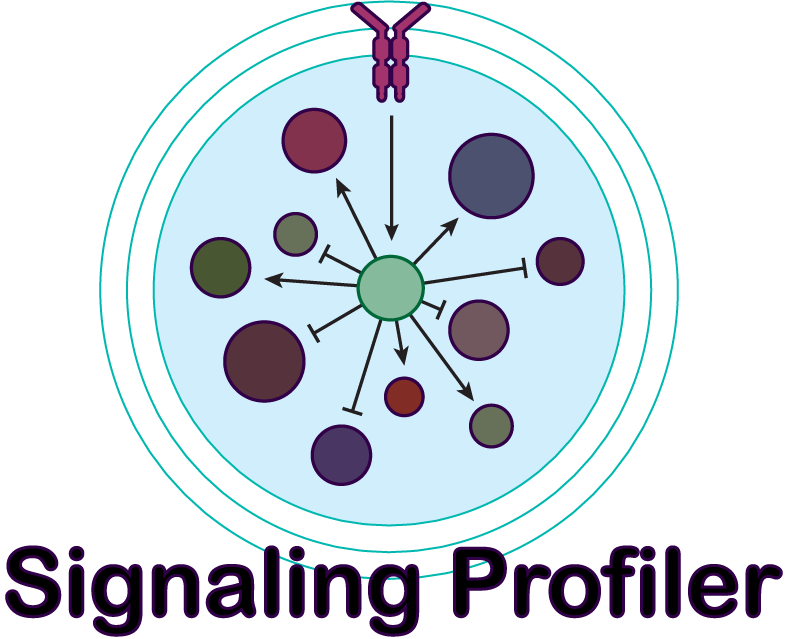
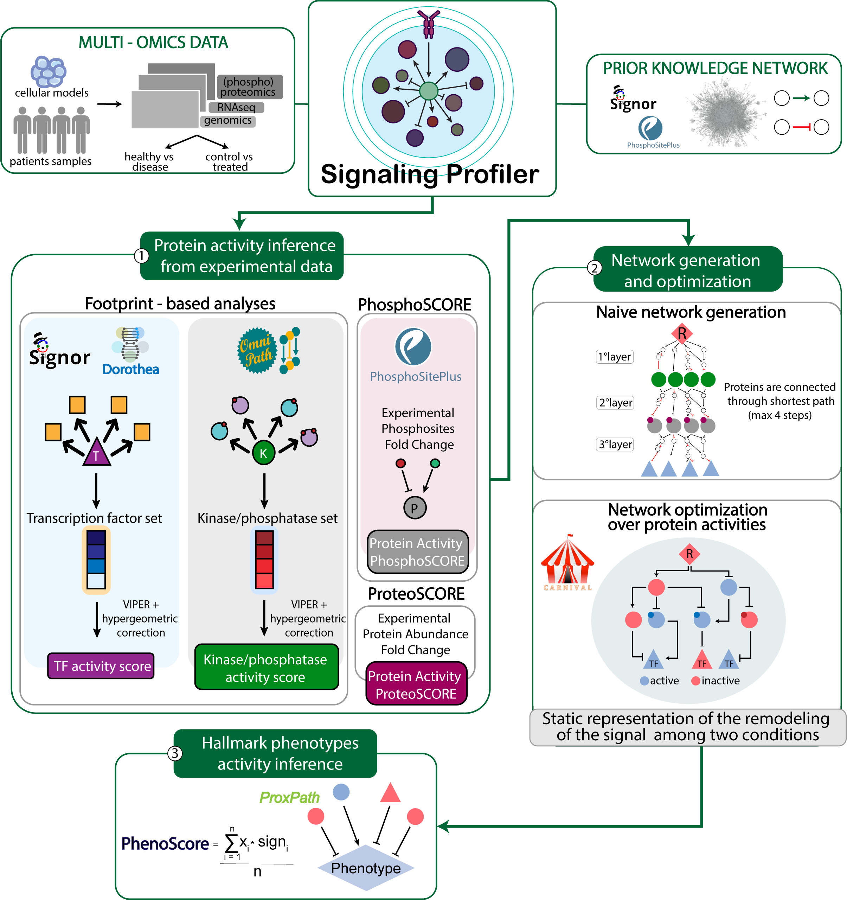

# Signaling Profiler 

## Overview

Signaling Profiler is a R based pipeline that integrates transcriptomics, proteomics and phosphoproteomics data among a case and a control to build a signaling network, connecting:

-   cellular receptor(s);
-   kinases and phosphatases;
-   targets of phosphorylation;
-   transcription factors;

This network provides mechanistics hypoteses about the remodeling of the signal due to your case.

# 

## Installation

To install Signaling Profiler execute the following command in R.

R \>= 4.1 is required

``` r
devtools::install_github('https://github.com/SaccoPerfettoLab/SignalingProfiler/')
```

SignalingProfiler is currently under active development, as such we suggest to delete and re-install the package regularly 
to exploit the new features. 

## Prerequisites

Signaling Profiler is dependent on Saez lab algorithm CARNIVAL for performing the signalling pathway optimization. You can find all the instruction for installation in Saez lab repository [CARNIVAL](https://saezlab.github.io/CARNIVAL/).

## Tutorial

The latest tutorial of *SignalingProfiler* 2.0 is available [here](https://html-preview.github.io/?url=https://github.com/SaccoPerfettoLab/SignalingProfiler/blob/main/SignalingProfiler-2.0-tutorial/SignalingProfiler-2.0-tutorial.html).

Another tutorial for human is available [here](https://html-preview.github.io/?url=https://github.com/SaccoPerfettoLab/SignalingProfiler/blob/main/vignettes/SP_vignette_human.html)

You can find an example of SignalingProfiler analysis for mouse [here](https://html-preview.github.io/?url=https://github.com/SaccoPerfettoLab/SignalingProfiler/blob/main/vignettes/SignalingProfiler_vignette.html). 

## Citation
If you use SignalingProfiler in your research please cite the [original publication](https://www.nature.com/articles/s41375-022-01785-w).

> Massacci, G., Venafra, V., Latini, S. et al. A key role of the WEE1-CDK1 axis in mediating TKI-therapy resistance in FLT3-ITD positive acute myeloid leukemia patients. Leukemia (2022). https://doi.org/10.1038/s41375-022-01785-w

## License
