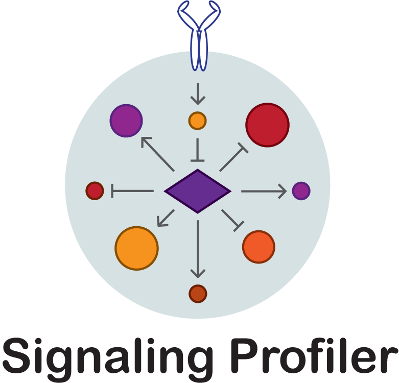

# Signaling Profiler 

## Overview

Signaling Profiler is a R based pipeline that integrates transcriptomics, proteomics and phosphoproteomics data among a case and a control to build a signaling network, connecting:

-   cellular receptor(s);
-   kinases and phosphatases;
-   targets of phosphorylation;
-   transcription factors;

This network provides mechanistics hypoteses about the remodeling of the signal due to your case.

## Installation

Signaling Profiler is still in development, but if you want to try it execute the following commands in R.

R \>= 4.1 is required

``` r
devtools::install_github('https://github.com/SaccoPerfettoLab/SignalingProfiler/')
```

## Prerequisites

Signaling Profiler is dependent on Saez lab algorithm CARNIVAL for performing the signalling pathway optimization. You can find all the instruction for installation in Saez lab repository [CARNIVAL](https://saezlab.github.io/CARNIVAL/).

## Tutorial

Work in progress.

## Citation
If you use Signaling Profiler for your research please cite the [BioRxiv publication](https://www.biorxiv.org/content/10.1101/2022.05.16.492070v1).

## License
