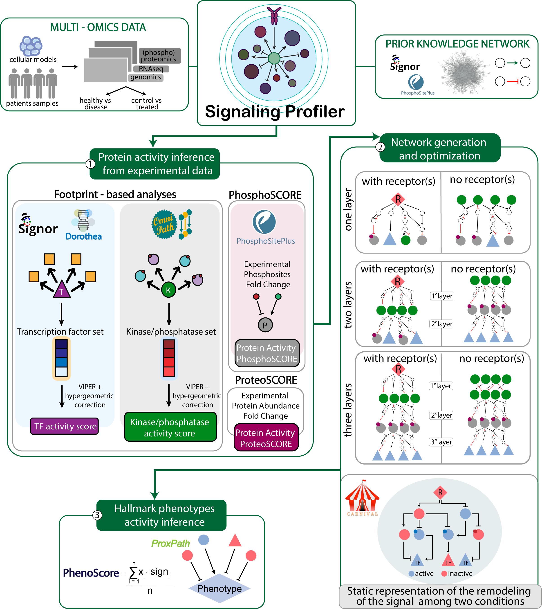

```{r, include = FALSE}
knitr::opts_chunk$set(
  cache = FALSE,
  echo = TRUE,
  warning = FALSE,
  error = FALSE,
  message = FALSE,
  collapse = TRUE,
  comment = "#"
)
```



# Introduction

Signaling Profiler is a modelling pipeline described in [Massacci, Venafra et al. (2022)](https://www.biorxiv.org/content/10.1101/2022.05.16.492070v1) that combines transcriptomics, proteomics and phosphoproteomics with prior knowledge annotated in public databases, such as SIGNOR and PhosphoSitePlus.

Briefly, **Signaling Profiler allows to build a mechanistic model representing the signal remodeling upon a treatment or in a disease condition**. The model starts with receptor(s) and ends with proteins whose activity is modulated (up- or down-regulated) among your two conditions (e.g. treated vs untreated, disease vs healthy).

It takes advantage of previously developed algorithms (e.g. VIPER, CARNIVAL) and complements them with novel additional features that allow a more exhaustive integration of phosphoproteomics data (**phosphoSCORE**) and *in silico* validation results (**phenoSCORE**).

# Installation

```{r eval = FALSE}
devtools::install_github('https://github.com/SaccoPerfettoLab/SignalingProfiler/')
```

## Prerequisites

The two most important prerequisites for the usage are:

-   **blastp** to exhaustively compute the *phosphoSCORE* if you are using mice data;

-   **ILP solver** required by CARNIVAL algorithm to optimize your model against experimental data;

### Install blastp

1.  Go to where the installers and source code are available [here](https://ftp.ncbi.nlm.nih.gov/blast/executables/blast+/LATEST/)

2.  Download the ".tar.gz' file for your operating system. All the commands/binaries are in the *bin* sub-directory.

#### Windows systems

3.  **Pay attention to the location where blast is installed, you will need it later**

It should be something like: "C:\\Program Files\\NCBI\\blast-BLAST_VERSION+\\bin\\blastp".

#### Unix-like systems

3.  Add to \$PATH variable the bin blast sub-directory.

```{r eval = FALSE}
export PATH="$PATH:/Users/[YOUR_USERNAME]/bin/ncbi-blast-2.13.0+/bin"
```

### Install ILP Solver

CARNIVAL algorithm relies on a **solver of integer linear programming (ILP) problems**, that you must install. An exhaustive guide about installation can be found in *Prerequisites* section of CARNIVAL github page [here](https://saezlab.github.io/CARNIVAL/).

# Running Signaling Profiler

```{r setup}
library(SignalingProfiler)
```

The Signaling Profiler package provides a flexible way to create signaling networks integrating transcriptomics, proteomics and phosphoproteomics data. The pipeline is divided in three main steps:

-   inference of key signaling proteins activity from multi-omics data (**Step 1**);

-   building a naïve network connecting receptor(s) to key signaling proteins through the molecular interactions annotated in SIGNOR and PhosphoSitePlus databases (**Step 2**);

-   optimization of the naïve network on proteins activity through CARNIVAL algorithm (**Step 3**);

## Toy datasets

In the Signaling Profiler package there are *toy datasets* to show the format of omic data tables and to perform some tests.

```{r eval = FALSE}
# toy omics datasets
tr_toy_df
prot_toy_df
phospho_toy_df

# inferred proteins datasets
toy_prot_activity_df

# toy naïve networks
one_layer_toy
two_layers_toy
three_layers_toy

# toy CARNIVAL input 
carnival_input_toy

# toy Signaling Profiler output
toy_sp_output
```

## Input data tables

Signaling Profiler requires a very processed table derived from your multi-omics data. Here, we describe the information needed by the package.

### Transcriptomics and Proteomics

Your transcriptomics and proteomics tables should contain the following columns:

-   **gene_ID**/**UNIPROT** and **gene_name**: reporting the gene ID and gene name respectively; we suggest to choose only one gene name for each gene since it will be used for matching data in the next steps;

-   **difference**: representing the fold-change in gene expression among two conditions; e.g. the difference between treated and control sample;

The next columns regards parameters linked to the statistical test performed among your conditions:

-   **logpval**: the p-value associated to your fold-change;

-   **significant**: a column containing a '+' if the gene is significantly modulated, NA otherwise;

```{r}
head(tr_toy_df)
```

```{r}
head(prot_toy_df)
```

### Phosphoproteomics

Before using Signaling Profiler, you have to accurately process you phosphoproteomics data set. The most important step is to have **ONLY ONE OCCURENCE OF EACH PHOSPHOSITE**. If you have a phosphosite quantified more than once, you have to choose the most reliable quantification (usually the lowest multiplicity).

Your phosphoproteomics table should contain:

-   **UNIPROT** and **gene_name**: reporting the UNIPROT ID and the gene name respectively; again, choose just one gene name.

-   **aminoacid** and **position**: reporting the phosphosite with the single letter notation and the position in the protein sequence;

-   **sequence window**: the phosphopeptide centered on the modified residue; it should be at least a 15-mer, compatible with SIGNOR and PsP database notation;

-   **difference**: representing the fold-change in gene expression among two conditions; e.g. the difference between treated and control sample;

-   **logpval**: the p-value associated to the statistical test assessing the significance of your comparisons;

-   **significant**: a column containing a '+' if the gene is significantly modulated, NA otherwise;

```{r}
head(phospho_toy_df)
```

## Step 1) Infer protein activities from multi-omics data

Signaling Profiler allows to infer protein activities from omic data through different strategies:

-   **Footprint-based analysis**: you infer the activity of a transcription factor (or kinases and phosphatases) from the modulation of its targets;

-   **Phosphoscore analysis**: you infer the activity of phosphoproteins from the modulation of its regulatory phosphosites;

-   **Proteoscore analysis**: you infer the activity of proteins from the modulation of their quantity in the proteomic data set;

If multiple scores are available for a protein, you can combine them. For example, if you have a transcription factor you can infer its activity from both (i) its target genes (transcriptomics) and its regulatory phosphosites (phosphoproteomics) and then you average the scores.

### Step 1A) Footprint based analysis

Footprint-based analysis derives protein activity *from the modulation of its downstream targets* using the VIPER statistical tool. The set of regulated analytes of a protein is called *regulon*. Transcription factors' activity is calculated from transcriptomic data whereas kinases and phosphatases' activity from phosphoproteomic data.

#### Signaling Profiler regulons

-   Transcription factors - target genes collection (`tfea_db`) was retrieved from DoRothEA R Package (confidence: A) and from SIGNOR.
-   Kinases/phosphatases - target phosphosites collection (`ksea_db`) was derived from OmniPath;

You can see the collections printing the built-in variables:

```{r eval = FALSE}
tfea_db_human
tfea_db_mouse
ksea_db_human
ksea_db_mouse
```

Given the recent publication of the (Serine-Threonine Kinome Atlas)[<https://www.nature.com/articles/s41586-022-05575-3>] we integrated high confidence regulons in the `ksea_db` derived from this work. If you want to extend your data with the atlas, set `integrated_regulons = TRUE`.

#### Important parameters

The `reg_minsize` parameter is important to choose the number of targets in the protein's regulon overlapping with your experimental data. Setting `reg_minsize = 1` means deciding you infer the activity of a protein if you find one modulated protein target in your dataset.

The `exp_sign` parameter allow you to choose if you want to use the whole omic data (`exp_sign = FALSE`) or only the significant analytes (`exp_sign = TRUE`).

The `hypergeom_corr` parameter should be TRUE if you want to correct VIPER output with an hypergeometric test, that gives less importance to proteins with fewer significantly modulated targets in experimental data.

#### Infer the activity of transcription factors from transcriptomics

```{r eval = FALSE}
tf_activity_foot <- run_footprint_based_analysis(omic_data = tr_toy_df, 
                                              analysis = 'tfea', 
                                              organism = 'mouse', 
                                              reg_minsize = 1, 
                                              exp_sign = FALSE, 
                                              hypergeom_corr = TRUE,
                                              GO_annotation = FALSE)
```

#### Infer the activity of kinases and phosphatases from phosphoproteomics

```{r eval = FALSE}
# without the atlas
kin_phos_activity_foot <- run_footprint_based_analysis(omic_data = phospho_toy_df, 
                                              analysis = 'ksea', 
                                              organism = 'mouse', 
                                              reg_minsize= 1, 
                                              exp_sign = FALSE, 
                                              integrated_regulons = FALSE,
                                              hypergeom_corr = TRUE,
                                              GO_annotation = FALSE)

# with the atlas
kin_phos_activity_foot <- run_footprint_based_analysis(omic_data = phospho_toy_df, 
                                              analysis = 'ksea', 
                                              organism = 'mouse', 
                                              reg_minsize= 1, 
                                              exp_sign = FALSE, 
                                              integrated_regulons = TRUE,
                                              hypergeom_corr = TRUE,
                                              GO_annotation = FALSE)
```

### Step 1B) PhosphoSCORE

PhosphoSCORE computation exploits:

-   the experimental fold-change of the phosphosites;

-   the regulatory role of phosphosites annotated in SIGNOR and PsP databases;

You can vary the analysis choosing the type of regulatory phosphosites used. In fact you can:

-   set the `activatory = TRUE`: to select only phosphosites modulating the activity of proteins;

-   set the `activatory = FALSE`: to select all phosphosites, so the ones modulating the activity, the quantity, etc.;

If you are working on **mouse dataset**, you can use known regulatory phosphosites in mouse. However, the coverage is lower than human knowledge. As such, we developed a strategy exploiting **blastp** which maps mouse phosphopeptides on human ones, and exploits the regulatory role in human. As such, you can enlarge the coverage setting the `organism = 'hybrid'`.

#### Activatory analysis in mouse regulatory phosphosites

```{r eval = FALSE}
phosphoscore_mouse <- phosphoscore_computation(phosphoproteomic_data = phospho_toy_df, 
                                               organism = 'mouse', 
                                               activatory = TRUE , 
                                               GO_annotation= FALSE)
```

#### Activatory analysis in hybrid regulatory phosphosites

**THIS ANALYSIS REQUIRES BLASTP INSTALLED** Please check the Prerequisites session.

##### Unix-like systems

```{r eval = FALSE}
phosphoscore_hybrid <- phosphoscore_computation(phosphoproteomic_data = phospho_toy_df, 
                                               organism = 'hybrid', 
                                               activatory = TRUE , 
                                               GO_annotation= TRUE)
```

##### Windows systems

For Windows system is dangerous to modify the PATH variable. As such, you should specify the path in your system of blastp. Since, unfortunately folders have spaces in Windows system, you need to pass the path as a string. So the first quotes represent the ones necessary for the argument itself, the second pairs of quotes represent the ones necessary to handle the spaces in the path!

```{r eval = FALSE}
phosphoscore_hybrid <- phosphoscore_computation(phosphoproteomic_data = phospho_toy_df, 
                                               organism = 'hybrid', 
                                               activatory = TRUE ,
                                               blastp_path = "\"C:\\Program Files\\NCBI\\blast-BLAST_VERSION+\\bin\\blastp\"",
                                               GO_annotation= TRUE)
```

### Step 1A+B) Combine Footprint and PhosphoSCORE

Once you have computed the proteins' activity with footprint-based approaches and PhosphoSCORE you can average the scores. This should be done separately for transcription factors and kinases and phosphatases.

```{r eval = FALSE}
# for transcription factors
combined_tf <- combine_footprint_and_phosphoscore(footprint_output = tf_activity_foot,
                                                  phosphoscore_df =  phosphoscore_mouse, 
                                                  analysis =  'tfea')

# for kinases and phosphatases
combined_kin_phos <- combine_footprint_and_phosphoscore(footprint_output = kin_phos_activity_foot,
                                                  phosphoscore_df =  phosphoscore_mouse, 
                                                  analysis =  'ksea')
```

### Step 1C) ProteoSCORE

If you want to consider the significant modulation of proteins' abundance as a proxy of activity, you can use the *ProteoSCORE* analysis. For example, if a protein is down-regulated in its quantity, it will be considered down-regulated in its activity.

```{r eval = FALSE}
proteoscore_df <- activity_from_proteomics(prot_df = prot_toy_df, 
                                           organism = 'mouse')

```

You can combine the activity inferred from the previous methods with ProteoScore output.

```{r eval = FALSE}
activity_proteo_combined_df <- combine_activityscore_proteoscore(activity_score = combined_tf, 
                                                                 proteo_score = proteoscore_df)
```

### Discussion about the first step

As you may notice, there are a lot of techniques to derive the activity of proteins in this package. It is up to you and the data you have the choice of the methods and the combination of methods to use.

The end of this first step should be a single table containing all the proteins for which you inferred the activity with their molecular function.

You can assess the proteins molecular function setting `GO_annotation = TRUE` in the previous analyses.

You can find an example in a built-in object.

```{r eval = TRUE}
toy_prot_activity_df
```

### A simple inference workflow

```{r eval = FALSE}
# ** STEP 1A **
# infer the activity of transcription factors from transcriptomics data
tf_activity_foot <- run_footprint_based_analysis(omic_data = tr_toy_df, 
                                              analysis = 'tfea', 
                                              organism = 'mouse', 
                                              reg_minsize= 1, 
                                              exp_sign = FALSE, 
                                              hypergeom_corr = TRUE,
                                              GO_annotation = TRUE)

# infer the activity of kinases and phosphatases from phosphoproteomics data
kin_phos_activity_foot <- run_footprint_based_analysis(omic_data = phospho_toy_df, 
                                              analysis = 'ksea', 
                                              organism = 'mouse', 
                                              reg_minsize= 1, 
                                              exp_sign = FALSE, 
                                              hypergeom_corr = TRUE,
                                              GO_annotation = TRUE)

# ** STEP 1B **
# compute hybrid phosphoscre to get the largest coverage of regulatory phosphosites
phosphoscore_hybrid <- phosphoscore_computation(phosphoproteomic_data = phospho_toy_df, 
                                               organism = 'hybrid', 
                                               activatory = TRUE , 
                                               GO_annotation= TRUE)

# ** STEP 1AB **
# combine footprint analysis and phosphoscore anlaysis
combined_tf <- combine_footprint_and_phosphoscore(footprint_output = tf_activity_foot,
                                                  phosphoscore_df =  phosphoscore_hybrid, 
                                                  analysis =  'tfea')


combined_kin_phos <- combine_footprint_and_phosphoscore(footprint_output = kin_phos_activity_foot,
                                                  phosphoscore_df =  phosphoscore_hybrid, 
                                                  analysis =  'ksea')

# divide tables according to molecular functions
toy_tf <- combined_tf
toy_kin <- combined_kin_phos
toy_other <- phosphoscore_hybrid %>%
  dplyr::filter(mf == 'other') %>%
  dplyr::rename(final_score = phosphoscore) %>%
  dplyr::mutate(method = 'PhosphoScore')

# create a unified 'activity modulation' table for the next steps
toy_activity_df <- dplyr::bind_rows(toy_tf, toy_kin, toy_other) %>%
  select(UNIPROT, gene_name, mf, final_score, method)

# ** STEP 1C **
# if you want to enlarge the list of proteins you can use proteomics data
# infer activity of protein from its abundance modulation
proteoscore_df <- activity_from_proteomics(prot_df = prot_toy_df,
                                           organism = 'mouse')

toy_prot_activity_df <- combine_activityscore_proteoscore(toy_activity_df, proteoscore_df)
```

## Step2) Naïve network creation

In this step, Signaling Profiler connects the proteins of Step1 to user-specified receptor(s). These receptor(s) could represent:

-   target of a treatment;
-   some mutated genes in your biological process;

Here, we create what we call a **naïve network**, a graph connecting your proteins through **ALL** the possible **SHORTEST** causal paths of a user-specified length (1 to 4). We don't consider the causality of the edges, just distance. As such, in the naïve network there may be two paths with same length, but different causal meaning.

In this step, you are building the skeleton of the signal of your cellular model, looking across all the possible routes available in SIGNOR and PsP databases. We call the set of interactions **Prior Knowledge Network (PKN)**. These databases are available for both *human* and *mouse* organisms, as built-in objects in the package, in tabular (`PKN_mouse`, `PKN_human`) and igraph object format (`db_mouse`, `db_human`).

### Choose and preprocess the PKN

The first step is to choose the Prior Knowledge Network (PKN).

Signaling Profiler allow you to use built-in PKNs for **mouse** and **human** or to exploit a **custom PKN.** For the custom PKN you have to provide the path of the file and this allow you to use old version of PKNs, available in the PKN_old_release folder of our GitHub page.

For **human** you can choose between a PKN containing the interactions from only databases, or a PKN containing interactions also derived from the [kinome atlas](https://www.nature.com/articles/s41586-022-05575-3), specifying the `with_atlas = TRUE`.

```{r eval = FALSE}
PKN_table <- choose_PKN(organism = 'mouse', 
                        with_atlas = FALSE,
                        custom = FALSE,
                        custom_path = NULL)
```

Since the **PKN** contains interactions coming from different experimental systems, a good practice is to keep only the interactions involving analytes expressed in your system, so quantified in at least one of your omics data sets.

```{r eval = FALSE}
PKN_expressed <- preprocess_PKN(omics_data = list(tr_toy_df, prot_toy_df, phospho_toy_df),
                                PKN_table = PKN_table)
```

Otherwise, you can work with the whole organism-specific PKN tables stored in the built-in variable (`PKN_mouse`, `PKN_human`, `PKN_human_atlas`).

### Assess coverage of the PKN

Even if you inferred the activity of a protein, it may be absent in the PKN. As such, a good practice is to check for database coverage of your inferred proteins data set.

If you set `report=TRUE`, a report file is written in your working directory. If you are using the human PKN extended with atlas interactions, set `with_atlas=TRUE`.

```{r eval = FALSE}
coverage_of_inferred_proteins_in_db(toy_prot_activity_df, 
                                    organism = 'mouse', 
                                    with_atlas = FALSE, 
                                    report = FALSE) 
```

### How to build a naïve network?

You can build the naïve network in three ways:

-   ONE LAYER NETWORK: from **starting proteins** (e.g., receptor(s)) to all the inferred proteins;

-   TWO LAYERS NETWORK:

    -   first layer: from **starting proteins** (e.g. receptor(s)) to **intermediate proteins** (e.g. kinases, phosphatases, other molecular functions (phosphoproteins)):

    -   second layer: from **intermediate proteins** (e.g. kinases, phosphatases, other molecular functions) to **target proteins** (e.g.) transcription factors;

-   THREE LAYERS NETWORK:

    -   first layer: from **starting proteins** (e.g. receptor(s)) to **intermediate 1 proteins** (e.g. kinases and phosphatases);

    -   second layer: from **intermediate 1 proteins** (e.g. kinases and phosphatases) to **intermediate 2 proteins** (e.g. other molecular function (phosphoproteins));

    -   third layer: from **all second layer proteins** to **target protein** (e.g. transcription factors);

In each layer, you can specify the `max_length` of the paths. Usually, we create a second layer of direct connections (max_length = 1) to connect kinases and phosphatases to their targets.

You can modulate the structure of the naïve network:

-   choosing which proteins are the starting, intermediates 1 and 2 and targets nodes;

-   choosing the number of layers: the largest is the number of layers, deeper you go in the molecular mechanism behind your experimental condition; but, it is also true that longer path aren't biologically relevant. So it is pretty much empirical.

### One layer network

```{r eval = FALSE}
one_layer_toy <- one_layer_naive_network(starts_gn = c('Flt3'),
                                         targets_gn = toy_prot_activity_df$gene_name,
                                         PKN_table = PKN_expressed, #or PKN_mouse 
                                         max_length = 4)
                            
one_layer_toy
```

### Two layers network

```{r eval = FALSE}
# divide proteins according to the molecular function
kin_phos_other <- toy_prot_activity_df %>% 
  dplyr::filter(mf %in% c('kin', 'phos', 'other'))
tfs <- toy_prot_activity_df %>% 
  dplyr::filter(mf == 'tf')

# create the naïve network
two_layers_toy <- two_layer_naive_network(starts_gn = c('Flt3'),
                             intermediate_gn = kin_phos_other$gene_name,
                             targets_gn = tfs$gene_name, 
                             PKN_table = PKN_expressed, #or PKN_mouse
                             max_length_1 = 4, 
                             max_length_2 = 4)
```

### Three layers network

```{r eval = FALSE}
# divide proteins according to the molecular function
kin_phos <- toy_prot_activity_df %>% 
  dplyr::filter(mf %in% c('kin', 'phos'))
other <- toy_prot_activity_df %>% 
  dplyr::filter(mf == 'other')
tfs <- toy_prot_activity_df %>% 
  dplyr::filter(mf == 'tf')

# create the naïve network
three_layers_toy <- three_layer_naive_network(starts_gn = c('Flt3'),
                                          intermediate1_gn = kin_phos$gene_name,
                                          intermediate2_gn = other$gene_name,
                                          targets_gn = tfs$gene_name,
                                          both_intermediates = TRUE,
                                          PKN_table = PKN_expressed, #or PKN_mouse
                                          max_length_1 = 4,
                                          max_length_2 = 1,
                                          max_length_3 = 4)
```

### Prepare CARNIVAL input

Here, we prepare the input for the third step of Signaling Profiler.

-   Since, Signaling Profiler may not be able to connect all the inferred proteins in the naïve network, we keep in the inferred proteins' table only the proteins connected in the naïve network.

-   Moreover, in this step, we add a list of receptor with their estimated change of activity upon our perturbation. If `receptor_list = NULL` you don't add any receptor.

```{r eval = FALSE}
receptor_list <- list('Flt3' = -1)

carnival_input <- prepare_carnival_input(one_layer_toy, 
                                         toy_prot_activity_df, 
                                         receptor_list, 
                                         organism = 'mouse')
```

An example of the result is in this built-in object

```{r eval = TRUE}
carnival_input_toy
```

## Step 3) Optimization of naïve network and creation of a context-specific model

### Setting CARNIVAL algorithm parameters (ILP solver)

This step optimizes the naïve network in a context-specific model through CARNIVAL algorithm.

It is crucial to install the ILP solver (we suggest ***cplex***) required by CARNIVAL and specify its name to set the default options of the algorithm.

```{r eval = FALSE}
solver = 'cplex'
carnival_options = default_CARNIVAL_options(solver)
```

It is very important to know the *path* of the ILP software.\
If you didn't install it using the default path you can set the custom path here.

```{r eval = FALSE}
#for Windows
carnival_options$solverPath = "C:/Program Files/CPLEX_solver/cplex/bin/x64_win64/cplex.exe" 

#for macOS
carnival_options$solverPath = '/Applications/CPLEX_Studio221/cplex/bin/x86-64_osx/cplex' 

```

Then, you can customize the parameters of the solver.\
We suggest to first try using the default parameters.

```{r eval = FALSE}
carnival_options$threads <- 2
carnival_options$mipGAP <- 0.05
carnival_options$timelimit <- 3600
carnival_options$cplexMemoryLimit <- 8192
```

### What do you do in this step?

The naïve network contains all the shortest paths among two proteins: this means that you may have two paths with same length but different causal meaning.

**CARNIVAL chooses the paths with causal effect being coherent with proteins' activities along the path.**

To run CARNIVAL algorithm you need to:

-   Create a tibble with the starting point(s) of the model (**source_df**);

-   Create a tibble with the ending points of the model (**target_df**);

-   Provide the *naïve network* in SIF format (Step 2 creates the file in your working directory) (**naïve_network**);

-   Provide the whole inferred proteins tibble (**proteins_df**);

-   Provide the CARNIVAL options you created in the former step (**carnival_options**);

It is important to stress that CARNIVAL will find the SMALLEST model connecting your inferred proteins with causal edges coherent with their activity. As such, you may lose some proteins.

To keep the largest number of proteins and a greater number of mechanistic hypotheses, you can perform a two- or three-steps CARNIVAL.

### Vanilla CARNIVAL analysis (with perturbations/receptors)

#### One step CARNIVAL

The simplest analysis is *connecting the receptor(s) to all the inferred protein*.

```{r eval = FALSE}
source_df <- carnival_input_toy %>%
  dplyr::filter(mf == 'rec')

target_df <- carnival_input_toy %>%
  dplyr::filter(mf != 'rec')

one_layer_toy <- readr::read_tsv('./one_layer_naive.sif',
                                 col_names = c('source', 'interaction', 'target'))

output <- run_carnival_and_create_graph(source_df = source_df,
                                        target_df = target_df,
                                        naive_network = unique(one_layer_toy),
                                        proteins_df = carnival_input_toy,
                                        organism = 'mouse',
                                        carnival_options = carnival_options,
                                        files = TRUE,
                                        with_atlas = FALSE,
                                        path_sif = './optimized_network.sif',
                                        path_rds = './optimized_network.RDS')
```

After CARNIVAL optimization, we can map on the causal edges found by CARNIVAL the phosphosites significantly modulated in our phosphoproteomic dataset.

```{r eval = FALSE}
optimized_graph_rds <- readRDS('./optimized_network.RDS')
optimized_graph_sif <- readr::read_tsv('./optimized_network.sif',
                                       col_names = c('source', 'interaction', 'target'))

output_final <- expand_and_map_edges(optimized_graph_rds = optimized_graph_rds, 
                     optimized_graph_sif = optimized_graph_sif,
                     organism = 'mouse',
                     phospho_df = phospho_toy_df,
                     files = TRUE,
                      with_atlas = FALSE,
                     path_sif = 'optimized_network_validated.sif',
                     path_rds = 'optimized_network_validated.rds')

# get the optimized network as igraph object
output_final$igraph_network

# get nodes in the optimized model
output_final$nodes_df

# get edges in the optimized model
output_final$edges_df
```

#### Two steps CARNIVAL

Another type of analysis is to perform a two-steps CARNIVAL:

1)  connect the RECEPTOR(S) to KINASES, PHOSPHATASES and PHOSPHOPROTEINS;
2)  connect the KINASES, PHOSPHATASES and PHOSPHOPROTEINS connected in the previous step to TRANSCRIPTION FACTORS;

Finally, you perform the *union* of the two graphs.

```{r eval = FALSE}

# FIRST RUN: RECEPTOR to KIN, PHOS, OTHERS
receptors_df <- carnival_input_toy %>%
  dplyr::filter(mf == 'rec')

target1_df <- carnival_input_toy %>%
  dplyr::filter(mf %in% c('kin', 'phos', 'other'))

one_layer_toy_df <- readr::read_tsv('./one_layer_naive.sif',
                                 col_names = c('source', 'interaction', 'target'))

output1 <- run_carnival_and_create_graph(source_df = receptors_df,
                                         target_df = target1_df,
                                         naive_network = unique(one_layer_toy_df),
                                         proteins_df = carnival_input_toy,
                                         organism = 'mouse',
                                         carnival_options = carnival_options,
                                         files = TRUE,
                                         with_atlas = FALSE,
                                         path_sif = './optimized_network1.sif',
                                         path_rds = './optimized_network1.RDS')


# SECOND RUN: from KIN, PHOS, OTHERS to TFs
run1_output_nodes <- convert_output_nodes_in_next_input(output1)

source_df <- run1_output_nodes %>%
  dplyr::filter(mf %in% c('kin', 'phos', 'other'))

target2_df <- carnival_input_toy %>%
  dplyr::filter(mf == 'tf')

output2 <- run_carnival_and_create_graph(source_df = source_df,
                                         target_df = target2_df,
                                         naive_network = unique(one_layer_toy_df),
                                         proteins_df = carnival_input_toy,
                                         organism = 'mouse',
                                         carnival_options = carnival_options,
                                         files = TRUE,
                                         with_atlas = FALSE,
                                         path_sif = './optimized_network2.sif',
                                         path_rds = './optimized_network2.RDS')
# UNION OF RUN1 and RUN2 graphs 
union <- union_of_graphs(graph_1 = output1$igraph_network, 
                         graph_2 = output2$igraph_network, 
                         proteins_df = carnival_input_toy, 
                         files = TRUE, 
                         path_sif = './union_network1.sif', 
                         path_rds = './union_network1.RDS')

# EXPANSION and MAPPING of PHOSPHOPROTEOMICS DATA ON EDGES
union_graph_rds <- readRDS('./union_network1.RDS')
union_graph_sif <- readr::read_tsv('./union_network1.sif',
                                       col_names = c('source', 'interaction', 'target'))
union_output_final <- expand_and_map_edges(optimized_graph_rds = union_graph_rds, 
                                     optimized_graph_sif = union_graph_sif,
                                     organism = 'mouse',
                                     phospho_df = phospho_toy_df,
                                     files = TRUE,
                                     with_atlas = FALSE,
                                     path_sif = 'union_network_validated.sif',
                                     path_rds = 'union_network_validated.rds')

```

If you want to visualize the result, execute the following command.

```{r eval = FALSE}
RCy3::createNetworkFromIgraph(union_output_final$igraph_network, 
                              collection = 'two_steps_analysis')
```

#### Three steps CARNIVAL

The last type of analysis is to perform a three-steps CARNIVAL:

1)  connect the RECEPTOR(S) to KINASES and PHOSPHATASES;
2)  connect the KINASES and PHOSPHATASES to PHOSPHOPROTEINS;
3)  connect the KINASES, PHOSPHATASES and PHOSPHOPROTEINS connected in the previous steps to TRANSCRIPTION FACTORS;

Finally, you perform the *union* of the three graphs.

```{r eval = FALSE}
# FIRST RUN: RECEPTOR to KIN, PHOS, OTHERS
receptors_df <- carnival_input_toy %>%
  dplyr::filter(mf == 'rec')

target1_df <- carnival_input_toy %>%
  dplyr::filter(mf %in% c('kin', 'phos', 'other'))

one_layer_toy_df <- readr::read_tsv('./one_layer_naive.sif',
                                    col_names = c('source', 'interaction', 'target'))

output1 <- run_carnival_and_create_graph(source_df = receptors_df,
                                         target_df = target1_df,
                                         naive_network = unique(one_layer_toy_df),
                                         proteins_df = carnival_input_toy,
                                         organism = 'mouse',
                                         carnival_options = carnival_options,
                                         files = TRUE,
                                         with_atlas = FALSE,
                                         path_sif = './optimized_network1.sif',
                                         path_rds = './optimized_network1.RDS')

# SECOND RUN: from KIN, PHOS to OTHER
run1_output_nodes <- convert_output_nodes_in_next_input(output1)

source_df <- run1_output_nodes %>%
  dplyr::filter(mf %in% c('kin', 'phos'))

target2_df <- run1_output_nodes %>%
  dplyr::filter(mf %in% c('other'))

output2 <- run_carnival_and_create_graph(source_df = source_df,
                                         target_df = target2_df,
                                         naive_network = unique(one_layer_toy_df),
                                         proteins_df = carnival_input_toy,
                                         organism = 'mouse',
                                         carnival_options = carnival_options,
                                         files = TRUE,
                                         with_atlas = FALSE,
                                         path_sif = './optimized_network2.sif',
                                         path_rds = './optimized_network2.RDS')

#THIRD RUN: from KIN, PHOS to OTHER to TFs
run2_output_nodes <- convert_output_nodes_in_next_input(output2)
source2_df <- run2_output_nodes %>%
  dplyr::filter(mf %in% c('kin', 'phos', 'other'))

target3_df <- carnival_input_toy %>%
  dplyr::filter(mf == 'tf')

output3 <- run_carnival_and_create_graph(source_df = source2_df,
                                         target_df = target3_df,
                                         naive_network = unique(one_layer_toy_df),
                                         proteins_df = carnival_input_toy,
                                         organism = 'mouse',
                                         carnival_options = carnival_options,
                                         files = TRUE,
                                         with_atlas = FALSE,
                                         path_sif = './optimized_network2.sif',
                                         path_rds = './optimized_network2.RDS')

# UNION OF RUN1, RUN2 AND RUN3 GRAPHS 
union_run1_run2 <- union_of_graphs(graph_1 = output1$igraph_network, 
                                      graph_2 = output2$igraph_network, 
                                      proteins_df = carnival_input_toy, 
                                      files = TRUE, 
                                      path_sif = './union_network1.sif', 
                                      path_rds = './union_network1.RDS')$network

union_run1_run2_run3 <- union_of_graphs(graph_1 = union_run1_run2,
                               graph_2 = output3$igraph_network, 
                               proteins_df = carnival_input_toy, 
                               files = TRUE, 
                               path_sif = './union_network2.sif', 
                               path_rds = './union_network2.RDS')

# EXPANSION and MAPPING of PHOSPHOPROTEOMICS DATA ON EDGES
union2_graph_rds <- readRDS('./union_network2.RDS')
union2_graph_sif <- readr::read_tsv('./union_network2.sif',
                                   col_names = c('source', 'interaction', 'target'))
union2_output_final <- expand_and_map_edges(optimized_graph_rds = union2_graph_rds, 
                                           optimized_graph_sif = union2_graph_sif,
                                           organism = 'mouse',
                                           phospho_df = phospho_toy_df,
                                           files = TRUE,
                                           with_atlas = FALSE,
                                           path_sif = 'union2_network_validated.sif',
                                           path_rds = 'union2_network_validated.rds')

# VISUALIZATION OF THE NETWORK
RCy3::createNetworkFromIgraph(union2_output_final$igraph_network, 
                              collection = 'three_steps_analysis')
```

### Inverse CARNIVAL analysis (No perturbations/receptors)

If you haven't information about the targets of the perturbation (hence, you haven't a starting point), you can exploit the inverse CARNIVAL flavor. This flavor allows you to connect your modulated protein. The algorithm starts from the bottom of the signaling cascade and rises to the top, stopping at putative perturbed nodes upstream the proteins modulated in your conditions (contained in `target_df)`.

To run this flavor, simply set `source_df = NULL`.

```{r eval = FALSE}
# input preparation: remove 'receptors' from the carnival_input_toy table simulating you haven't a starting point 
target_df <- carnival_input_toy %>%
  dplyr::filter(mf != 'rec')

one_layer_toy <- readr::read_tsv('./one_layer_naive.sif',
                                 col_names = c('source', 'interaction', 'target'))

# inverse CARNIVAL analysis 
output <- run_carnival_and_create_graph(source_df = NULL,
                                        target_df = target_df,
                                        naive_network = unique(one_layer_toy),
                                        proteins_df = carnival_input_toy,
                                        organism = 'mouse',
                                        carnival_options = carnival_options,
                                        files = TRUE,
                                        with_atlas = FALSE,
                                        path_sif = './inv_optimized_network.sif',
                                        path_rds = './inv_optimized_network.RDS')

inv_optimized_graph_rds <- readRDS('./inv_optimized_network.RDS')
inv_optimized_graph_sif <- readr::read_tsv('./inv_optimized_network.sif',
                                       col_names = c('source', 'interaction', 'target'))

# mapping experimental data on the optimized network
inv_output_final <- expand_and_map_edges(optimized_graph_rds = inv_optimized_graph_rds, 
                     optimized_graph_sif = inv_optimized_graph_sif,
                     organism = 'mouse',
                     phospho_df = phospho_toy_df,
                     files = TRUE,
                     with_atlas = FALSE,
                     path_sif = 'inv_optimized_network_validated.sif',
                     path_rds = 'inv_optimized_network_validated.rds')

# VISUALIZATION OF THE NETWORK
RCy3::createNetworkFromIgraph(inv_output_final$igraph_network, 
                              collection = 'inv_CARNIVAL_analysis')
```

### Signaling Profiler output

The Signaling Profiler output is a list of three elements:

-   a graph as **igraph object** representing the context-specific mechanistic model;

-   a table of all the proteins (nodes) in the final model;

-   a table of all the interactions among the proteins in the model;

#### SP output graph

```{r eval = FALSE}
toy_sp_output$igraph_network
```

#### SP output proteins table (nodes_df)

The proteins in the final context-specific model are reported in `toy_sp_output$nodes_df` and they are annotated with different attributes:

-   Protein identifiers: **UNIPROT ID** (name) and **gene name**;

-   Two different activity scores:

    -   **final_score**: it is the activity derived from experimental data;
    -   **carnival_activity**: it is the activity computed by CARNIVAL algorithm ranging between -100 and +100; usually it has the *same sign* as the **final_score**, but sometimes CARNIVAL changes the node activity because the neighbour proteins suggest the opposite activity sign;
    -   **discordant:** it is TRUE if **final_score** and **carnival_activity** have opposite sign;

-   Molecular function annotation (**mf**);

```{r eval = TRUE}
toy_sp_output$nodes_df
```

#### SP output interactions table (edges_df)

The interactions among the proteins in the final context-specific model are reported in `toy_sp_output$edges_df` and they are annotated with different attributes:

-   UNIPROT IDs of the nodes connected (**source** and **target**);

-   **sign** reporting if the interaction is activatory (1) or inhibitory (-1);

-   **carnival_weight**: since CARNIVAL may return more than one solustion, this attribute reports the frequency of the edge in the different solutions returned (e.g. 100 means that the edge is present in all the solutions!);

-   annotation from phosphoproteomics data:

    -   **aminoacid**: reports the phosphosites in SIGNOR and PsP matching that interaction; if the phosphosite has a \* it means that it is *significantly modulated among your two conditions*;

    -   **FC**: reports the fold-change of phosphorylation among your two conditions of the phosphosite matched on the interaction;

    -   **is quantified** is TRUE if you quantified the phosphosite matching that edge in your phosphoproteomic data set;

```{r eval = TRUE}
toy_sp_output$edges_df
```

If you want to visualize the network in Cytoscape, we suggest the usage of RCy3 package. You have to open Cytoscape on your laptop and then run the following command.

```{r eval = FALSE}
RCy3::createNetworkFromIgraph(output_final$igraph_network, 
                              collection = 'one_step_analysis')
```

## Step 4) PhenoScore computation

Once you have your context-specific model, you can *in silico* validate it, computing the modulation of activity of relevant phenotypes for your context. We call this score **phenoSCORE**. It is very useful, especially when you have some expectations about your model characteristics. For example, if you are treating tumor cells you may expect the APOPTOSIS phenotype to be activated.

We compute the **phenoSCORE** using:

-   the nodes in the context-specific model;
-   paths table from SIGNOR proteins to SIGNOR phenotypes, containing different significant causal paths and derived from our in-house recently published resource [ProxPath](https://www.biorxiv.org/content/10.1101/2023.01.09.523265v1.full.pdf).

### Choose the phenotypes of interest

Put the name of desired phenotypes in a vector. 

```{r eval = FALSE}
# Execute this command to see all the available phenotypes
all_phenotypes
```

### Crucial concepts

In the PhenoScore computation we indirectly connect proteins to the phenotypes. You can choose the path_length between proteins an phenotype, from 2 to 4.

Crucial concepts: a protein can regulate a phenotype with multiple paths; - the phenotype will be regulated by activating and inhibitory paths;

### Phenoscore algorithm

-   **Select significant close phenotypes from ProxPath:** select from the ProxPath table the significantly close proteins next to your phenotypes of interest (key parameters are `zscore_threshold`, `stat`)

-   **Remove randomly regulated phenotypes:** given your protein list (`protein_df`), we sample a random protein list with the same number of proteins and compute the number of activating and inhibitory paths over the phenotype of interest from both lists. If the random list produces the same number of paths of your input list over a phenotype of interest, the phenotype is discarded, because it is regulated at random (key parameters are:`n_random`, `pvalue_threshold`).

-   **PhenoScore computation:** we compute the average of the activity of proteins regulating the same phenotype, with three considerations: (i) if two independent regulators are connected in the network (`sp_graph`), consider the most downstream (`remove_cascade = TRUE`); (ii) we weight proteins according to their number of paths over the phenotype (since they are more resilient, `node_idx = TRUE`); (iii) the activity considered can be both experimentally derived or derived from CARNIVAL algorithm (`use_carnival_activity = TRUE`).

### Output

The output is a table of three elements:

-   Table of the regulators of the phenotypes

-   Table of the phenotypes activities

-   Barplot of the phenotypes activities

### Example code

To compute the **PhenoScore** simply execute:

```{r eval = FALSE}
# for tumor context 
desired_phenotypes <- c('APOPTOSIS',
                        'CELL_DEATH',  'CELL_GROWTH', 'CELL_CYCLE_BLOCK',
                        'DNA_REPAIR',
                        'PROLIFERATION', 'IMMORTALITY', 'SURVIVAL')

toy_phenoscore_output<- phenoscore_computation(toy_sp_output$nodes_df,
                                               desired_phenotypes,
                                               toy_sp_output$igraph_network,
                                               # closeness of proteins to phenotypes
                                               path_length = 4,
                                               stat = 'mean',
                                               zscore_threshold = -1.96,
                                               # parameters for excluding randomly regulated phenotypes
                                               n_random = 1000,
                                               pvalue_threshold = 0.05,
                                               # parameters for context specificity
                                               remove_cascade = TRUE,
                                               node_idx = TRUE,
                                               use_carnival_activity = TRUE)
```

### Toy output
Since our toy model reflects a tumor cell line treated with a drug, we can see that the model recapitulates that the drug induces activation of death processes and inhibition of pro-survival pathways.

```{r eval = TRUE}
toy_phenoscore_output$table_phenotypes
```
